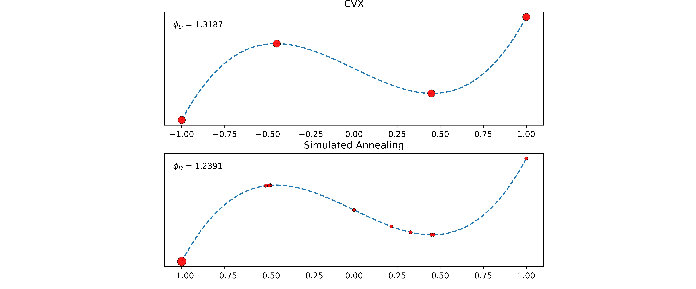

# Exact D-Optimal Design of Experiments Using Simulated Annealing

Exact D-optimal designs for various linear and nonlinear models have been obtained using simulated annealing and compared to Disciplined Convex Programming (DCP) methods provided by the optimization software known as CVX. Optimal experimental designs are very useful in practice due to their flexibility in model specification and domain constraints, as well as their ability to provide experimental designs with minimized parameter variance and experimental cost. However, exact designs are difficult to find when models are nonlinear and/or have high-dimensional parameter spaces. We propose the simulated annealing algorithm as a viable alternative to obtaining optimal designs in such cases; often simulated annealing outperforms CVX or provides a good approximation of the design in significantly reduced runtime.

Provided in this repository is code used for experimentation and implementation, as well as a [poster outlining results](report/bfrizzell_CSSC_poster_2024.pdf).

This project was supervised by [Dr. Julie Zhou](https://www.uvic.ca/science/math-statistics/people/home/faculty/zhou_julie.php) from the University of Victoria Department of Mathematics and Statistics.

## References
1. Berger, M., & Wong, W.K. (2009). An Introduction to Optimal Designs for Social and Biomedical Research. Wiley-Blackwell.
2. Wong, W.K. and Zhou, J. (2019), CVX-based algorithms for constructing various optimal regression designs. Can J Statistics, 47: 374-391. https://doi.org/10.1002/cjs.11499
3. Meyer, R. K., & Nachtsheim, C. J. (1988). Constructing Exact D-Optimal Experimental Designs by Simulated Annealing. American Journal of Mathematical and Management Sciences, 8(3–4), 329–359. https://doi.org/10.1080/01966324.1988.10737244
4. Montepiedra, G. (1998). Application of genetic algorithms to the construction of exact D-optimal designs. Journal of Applied Statistics, 25(6), 817–826. https://doi.org/10.1080/02664769822800

